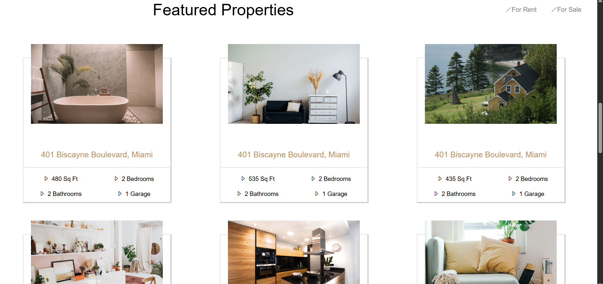

# 🌐 Simple Static Website

This is my **first web project** — a clean and simple static website built using **HTML** and **CSS**.  
It's not responsive yet, but it has a nice layout and is a great starting point for my frontend journey! 🚀

---

## 📸 Preview

  

---

## 🛠️ What I Used

- HTML5
- CSS3

---

## ✅ Features

- Simple and clean layout
- Beginner-friendly structure
- Good foundation for future improvements

---

## 📂 Project Structure
خ
## 🔗 Live Demo

You can see the project live here:  
👉 [Click to View Demo](http://127.0.0.1:5500/index.html)

---

## 📬 Contact Me

- 📧 Email: [homadiansetare12@gmail.com](mailto:homadiansetare12@gmail.com)
- 💻 GitHub: [setarehomadian80](https://github.com/setarehomadian80)
- 📸 Instagram: [novadeveloper-](https://instagram.com/novadeveloper-)

---

## ⭐ Give it a Star!

If you like this project, don’t forget to **⭐** it on GitHub and follow me for more cool stuff coming soon!

